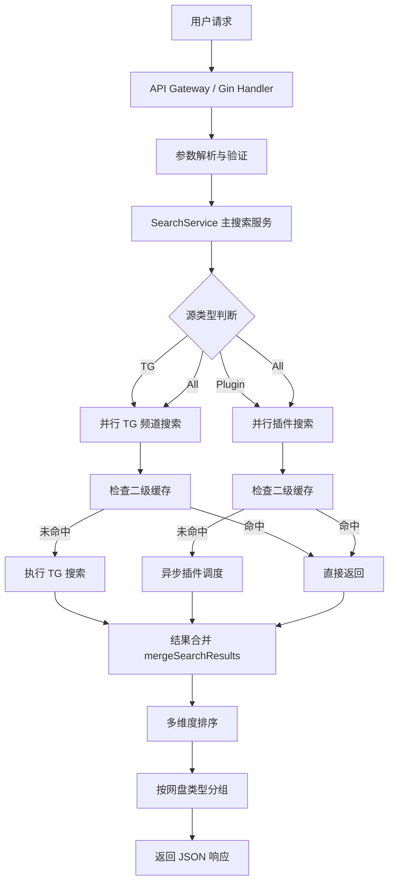

# 系统架构

## 整体架构

PanSou 采用分层架构，核心分为 HTTP 服务层、搜索服务层、插件系统层和工具层。

```
┌─────────────────────────────────────────┐
│           HTTP 服务层 (api/)             │
│  router.go  handler.go  middleware.go   │
└──────────────────┬──────────────────────┘
                   │
┌──────────────────▼──────────────────────┐
│         搜索服务层 (service/)            │
│  search_service.go  check_service.go    │
└──────┬───────────────────────┬──────────┘
       │                       │
┌──────▼──────┐         ┌──────▼──────────┐
│  TG 搜索     │         │  插件系统层       │
│  频道并发    │         │  plugin/        │
│  HTML 解析  │         │  70+ 插件        │
└──────┬──────┘         └──────┬──────────┘
       │                       │
┌──────▼───────────────────────▼──────────┐
│            工具层 (util/)                │
│  cache/  pool/  http_util  jwt  ...     │
└─────────────────────────────────────────┘
```

## 请求处理流程



## 异步插件机制

异步插件采用双级超时策略，在速度与完整性之间取得平衡：

```
用户请求
    │
    ├── [4秒超时] 快速返回部分结果 → 立即响应用户
    │
    └── [30秒后台] 持续处理完整结果 → 更新缓存
                                      下次请求直接命中 (<10ms)
```

## 目录结构

```
pansou/
├── api/
│   ├── router.go          # 路由注册
│   ├── handler.go         # 搜索请求处理
│   ├── check_handler.go   # 链接检测处理
│   ├── auth_handler.go    # 认证接口处理
│   ├── middleware.go      # JWT 认证中间件、CORS、日志
│   └── filter.go          # 结果过滤逻辑
├── config/
│   └── config.go          # 环境变量读取与配置初始化
├── model/
│   ├── request.go         # 请求结构体
│   ├── response.go        # 响应结构体
│   ├── plugin_result.go   # 插件结果结构体
│   └── check.go           # 链接检测结构体
├── plugin/
│   ├── plugin.go          # 插件接口定义 + 全局注册表
│   ├── baseasyncplugin.go # 异步插件基类
│   └── [插件名]/          # 各插件实现目录
├── service/
│   ├── search_service.go  # 核心搜索逻辑、排序、合并
│   ├── check_service.go   # 链接检测服务
│   └── cache_integration.go # 缓存集成
└── util/
    ├── cache/             # 二级缓存系统
    ├── pool/              # 工作池（WorkerPool + ObjectPool）
    ├── http_util.go       # HTTP 客户端工具
    ├── jwt.go             # JWT 生成与验证
    ├── parser_util.go     # HTML/JSON 解析工具
    └── regex_util.go      # 正则工具（链接提取）
```
